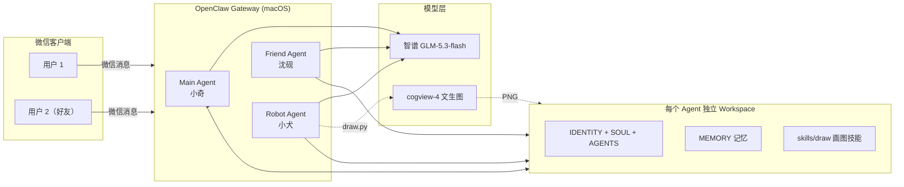

# WeChat Multi-Agent System（微信多智能体系统）

基于 [OpenClaw](https://github.com/openclaw/openclaw) 搭建的微信端多智能体系统，支持人设定制、记忆演化、文生图、定时提醒与拟人化主动消息推送。

> 每个微信账号对应一个独立 Agent，共享同一套运行框架，但拥有各自的工作区、人设与记忆，互不干扰。

## ✨ 特性

- **多智能体架构**：主对话代理（Main）、好友专属代理（Friend）、硬件控制代理（Robot）等，按微信账号路由
- **人设系统**：`IDENTITY.md`（固定人设）+ `SOUL.md`（性格分层）+ `AGENTS.md`（行为规则）三层注入，每轮对话自动携带
- **记忆演化**：`MEMORY.md` 持续记录用户偏好与关系节点，性格随聊天自然迭代，"越聊越熟"
- **画图链路**：智谱 cogview-4 文生图 → PNG 落盘到 workspace → 微信媒体通道发送，规避平台附件类型白名单限制
- **拟人化消息**：分段发送、表情/标点回复、随机主动消息（24h 主动窗口 + 单轮 10 条上限）
- **多模型接入**：智谱 GLM-5.3 / 豆包 Ark 等 OpenAI 兼容 API 统一配置

## 🏗️ 架构



## 🚀 快速开始

### 1. 安装 OpenClaw 并接入微信

```bash
npx -y @tencent-weixin/openclaw-weixin-cli@latest install
openclaw gateway install
openclaw gateway start
```

### 2. 配置 Agent

在 `~/.openclaw/openclaw.json` 中为每个账号配置独立 Agent（示例见 [`config/openclaw.example.json`](config/openclaw.example.json)）：

```json
{
  "agents": {
    "entries": {
      "main": {
        "workspace": "/path/to/main-workspace",
        "model": "zhipu/glm-5.3-flash",
        "tools": {
          "profile": "minimal",
          "alsoAllow": ["read", "write", "edit", "glob", "grep", "web_search", "message"],
          "message": { "actions": { "allow": ["send"] } }
        },
        "skills": ["draw"]
      }
    }
  }
}
```

### 3. 配置画图技能

```bash
export ZHIPU_API_KEY="your-zhipu-key"
python3 skills/draw/scripts/draw.py "一只戴星星的机器狗"
# 输出:
# URL: https://...
# PATH: <workspace>/media/draw.png
```

### 4. 启用人设与记忆

参考 [`agent-persona/IDENTITY.example.md`](agent-persona/IDENTITY.example.md) 创建你自己的 `IDENTITY.md`；`MEMORY.md` 由 Agent 在对话中自动维护。

## 📸 运行演示

画图技能真实运行（终端输出 URL/PATH）：


cogview-4 生成的图片示例：


## 📁 项目结构

```
wechat-multi-agent-system/
├── config/
│   └── openclaw.example.json   # OpenClaw 配置示例（脱敏）
├── skills/
│   └── draw/                   # 画图技能
│       ├── SKILL.md            # 技能定义与强制规则
│       └── scripts/draw.py     # cogview-4 文生图脚本
├── agent-persona/
│   └── IDENTITY.example.md     # 人设文件示例
├── docs/                       # 架构与排障文档
└── assets/                     # 截图与示意图
```

## ⚠️ 已知限制

- 微信通道硬限制：用户超过 24h 未发言无法主动发送；单轮回复上限 10 条
- 长内容请合并为一条消息，避免被截断
- 附件仅支持白名单类型（PNG/JPG 等），SVG/HTML 会发送失败

## 🔒 安全说明

- 所有 API Key 请通过环境变量注入，切勿提交到仓库
- Agent 工作区外文件默认不可访问（通过身份文件中的安全铁律约束）

## 📄 License

MIT
