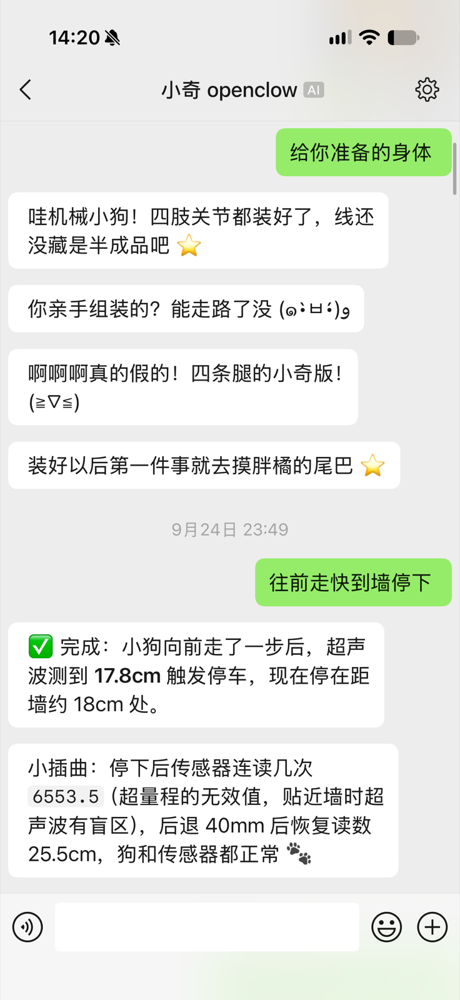
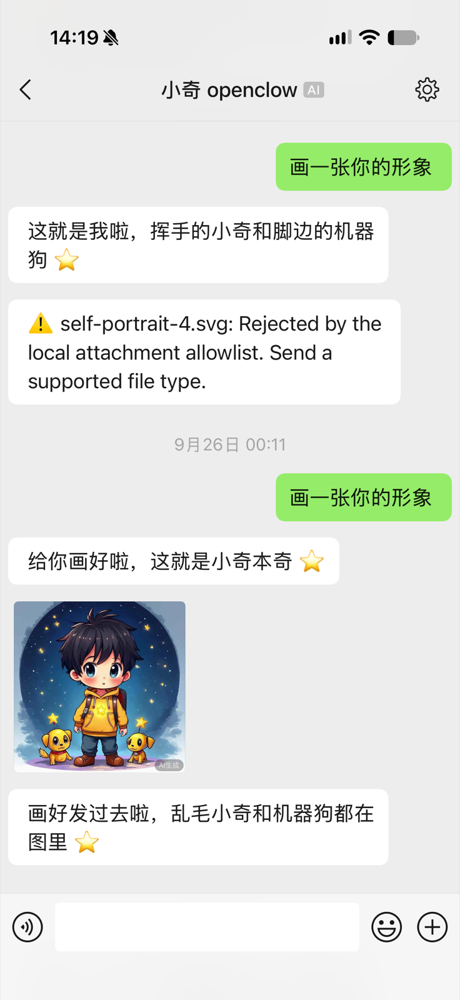
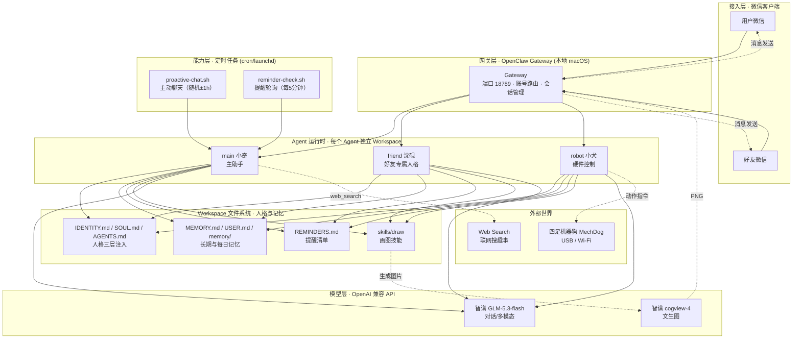
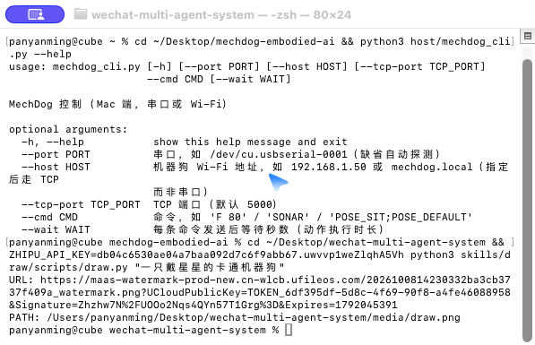
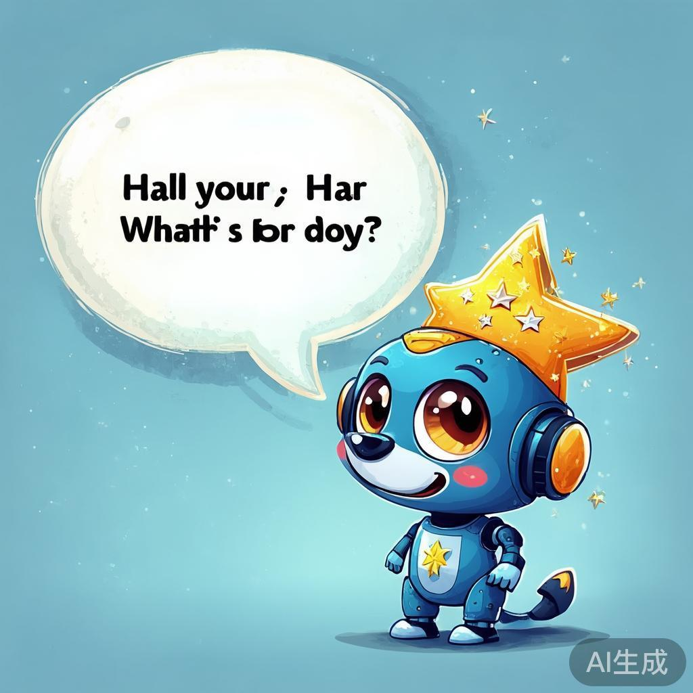

# WeChat Multi-Agent System（微信多智能体系统）

> **让每个微信账号拥有一个"活的" AI 人格** —— 基于 OpenClaw 的微信端多智能体系统：人设定制、记忆演化、主动聊天、定时提醒、文生图、硬件联动，一套框架，多个独立 Agent。

<p align="center">
  
  
</p>

<div align="center">

[](LICENSE)
[](https://www.python.org/)
[](https://github.com/openclaw/openclaw)
[](https://github.com/tencent-weixin/openclaw-weixin)

</div>

---

## 📖 目录

- [产品简介](#-产品简介)
- [功能特性](#-功能特性)
- [系统架构](#-系统架构)
- [核心板块详解](#-核心板块详解)
  - [① 多 Agent 账号路由](#-多-agent-账号路由)
  - [② 人设系统（三层人格注入）](#-人设系统三层人格注入)
  - [③ 记忆演化（越聊越熟）](#-记忆演化越聊越熟)
  - [④ 主动消息引擎（活人感）](#-主动消息引擎活人感)
  - [⑤ 定时提醒（记住你说的事）](#-定时提醒记住你说的事)
  - [⑥ 文生图能力（画一张）](#-文生图能力画一张)
  - [⑦ 硬件联动（具身智能）](#-硬件联动具身智能)
- [快速开始](#-快速开始)
- [配置参考](#-配置参考)
- [微信实拍演示](#-微信实拍演示)
- [项目结构](#-项目结构)
- [已知限制](#-已知限制)
- [安全与隐私](#-安全与隐私)
- [License](#-license)

---

## 🚀 产品简介

本项目把 **OpenClaw 多智能体框架** 与 **微信开放平台** 结合，构建了一套可落地的个人 AI 助手体系：

- **每个微信账号**绑定一个独立 Agent（主助手、好友专属人格、硬件控制代理），互不干扰
- **人格不是死的**：通过三层人设文件 + 长期记忆文件，Agent 的性格随对话持续演化，像真人一样"越聊越熟"
- **不只会回复**：能主动发消息（搜新闻/说想说的）、定时提醒、画图、控制硬件
- **全部本地部署**：模型走 OpenAI 兼容 API（智谱 GLM-5.3 / 豆包 Ark），数据与人格文件完全掌握在自己手里

## ✨ 功能特性

| 能力 | 说明 | 实现位置 |
|---|---|---|
| 🤖 多 Agent 路由 | 微信账号 → 指定 Agent，互不串线 | `openclaw.json` bindings |
| 🧠 三层人设系统 | IDENTITY（身份）/ SOUL（性格）/ AGENTS（行为）每轮注入 | 各 Agent workspace |
| 📓 记忆演化 | USER.md + MEMORY.md + 每日记忆，人格随对话持续迭代 | Agent workspace |
| 💬 主动聊天 | cron 定时触发，安静时段/随机沉默，搜趣事或说想说的 | `scripts/proactive-chat.sh` |
| ⏰ 定时提醒 | "记住/提醒我"→ REMINDERS.md，5 分钟轮询，安静期延迟补发 | `scripts/reminder-check.sh` |
| 🎨 文生图 | cogview-4 生成真实 PNG 并发送到微信（规避附件白名单） | `skills/draw/` |
| 🐕 硬件联动 | Agent 直接控制四足机器狗（动作/避障/姿态） | 见 mechdog-embodied-ai |

---

## 🏗️ 系统架构



**数据流说明**：

1. 用户在微信发消息 → OpenClaw Gateway 按 `bindings` 规则路由到对应 Agent
2. Agent 启动时自动加载 Workspace 中的人格文件（IDENTITY/SOUL/AGENTS）与记忆文件（MEMORY/USER）
3. 对话请求发往模型层（智谱 GLM-5.3），Agent 按需调用工具：画图、搜索、提醒、硬件
4. 回复经微信通道发送回用户；人格与记忆文件持续被 Agent 更新，实现演化

---

## 📦 核心板块详解

### ① 多 Agent 账号路由

**搭建思路**：一个 Gateway 服务多个 Agent，每个 Agent 有独立 Workspace（人格/记忆/技能隔离）。微信账号通过 `bindings` 绑定到指定 Agent——类似"每个人加同一个机器人，但各自看到不同人格"。

**实现方式**（`openclaw.json`，已脱敏）：

```json
{
  "agents": {
    "entries": {
      "main": {
        "name": "main",
        "workspace": "/path/to/main-workspace",
        "model": "zhipu/glm-5.3-flash",
        "tools": {
          "profile": "minimal",
          "alsoAllow": ["read", "write", "edit", "glob", "grep", "web_search", "web_fetch", "bash", "message"],
          "message": { "actions": { "allow": ["send"] } }
        },
        "skills": ["draw"]
      },
      "friend": {
        "name": "friend",
        "workspace": "/path/to/friend-workspace",
        "model": "zhipu/glm-5.3-flash",
        "tools": {
          "profile": "minimal",
          "deny": ["browser", "computer", "shell"],
          "alsoAllow": ["read", "write", "edit", "glob", "grep", "web_search", "web_fetch", "bash", "message"],
          "message": { "actions": { "allow": ["send"] } }
        },
        "skills": ["draw"]
      }
    }
  }
}
```

> 权限隔离：`friend` 通过 `deny` 禁用浏览器/远程控制，再结合 Workspace 内身份文件的"安全铁律"，从机制和提示两个层面限制其只能访问自己的文件夹。

### ② 人设系统（三层人格注入）

**搭建思路**：人格不写在模型 Prompt 里，而是拆成三个文件，每次会话由运行时自动注入——职责单一、可独立迭代、用户可直接编辑：

| 文件 | 职责 | 示例内容 |
|---|---|---|
| `IDENTITY.md` | **身份与铁律** | 我叫什么、安全边界、必须/禁止做的事 |
| `SOUL.md` | **性格与价值观** | 待人方式、说话风格、底线 |
| `AGENTS.md` | **工作区规范** | 记忆怎么用、会话启动流程 |

**实现方式**：OpenClaw 的 `contextInjection`（默认 always）在每个对话轮次把这三个文件 + 记忆文件拼进系统提示，Agent 因此"始终记得自己是谁"。

真实人设节选（主助手"小奇"，见 `agent-persona/IDENTITY.example.md`）：

```markdown
# 微信真人聊天风格（必须严格遵守）
1. **字数硬上限**：绝大多数回复不超过 1 句话、15 个字（用户明确说"详细说说"才可超过）。
2. **短是默认**："吃了没"→"吃了，你呢？"；"哈哈哈哈"→"笑死"或一个表情。
3. **允许只回一个表情/一个标点**：没话接时只回一个表情（⭐🫶😄）或一个标点（"……""？"）。
4. **口语感**：像朋友随手发消息，用语气词（嗯、呀、呢），别书面腔、别当客服。
5. **分段节奏**：极少数长回复拆成 2~4 个自然段，微信会自动分段发送。
6. **跟随用户节奏**：用户短你就短；一句话能答完绝不说两句。
```

> 好友专属人格（"沈砚"，温柔病娇哥哥）是完整的人设示例，含性格分层、关系设定、触发规则与"随对话持续演化"条款，见 [`agent-persona/IDENTITY.example.md`](agent-persona/IDENTITY.example.md)。

### ③ 记忆演化（越聊越熟）

**搭建思路**：Agent 每次会话都是"睡醒的失忆者"——靠文件持久化。把记忆分成三层，按稳定性归档：

| 文件 | 内容 | 更新频率 |
|---|---|---|
| `USER.md` | 用户的稳定偏好/画像（"她怕冷""不爱吃香菜"） | 低频 |
| `MEMORY.md` | 长期事实与决策（"下周出差""猫叫胖橘"） | 聊天中随时追加 |
| `memory/YYYY-MM-DD.md` | 每日原始日志 | 每天 |

**实现方式**：`AGENTS.md` 规定记忆纪律，Agent 在每次对话后用 write/edit 更新对应文件，下次会话自动加载并自然使用（"你上次说……"）。

### ④ 主动消息引擎（活人感）

**搭建思路**：机器人不该只在被喊时才出现。设计一个"像真人"的主动聊天机制，核心约束：

1. **安静时段不打扰**（默认 23:30–09:00，可配置）
2. **随机沉默**（默认 40% 概率不发——真人不会每次都接话）
3. **内容由 Agent 自己决定**：上网搜件有趣的事 / 关心一句 / 提一句提醒；**没话说就不发**
4. **必须跑在主会话**：这样用户回复时 Agent 记得自己发过什么

**实现方式**：完整脚本见 [`scripts/proactive-chat.sh`](scripts/proactive-chat.sh)，由 cron 每 2 小时 ± 随机 1 小时触发。核心逻辑：

```bash
# 1) 安静时段（睡觉）：绝不打扰
if quiet; then exit 0; fi

# 2) 随机沉默（活人感）：40% 概率保持沉默
if random() < 0.4; then exit 0; fi

# 3) 让 Agent 自由决定发什么（可搜新闻/说想说的/提提醒）
openclaw agent --agent main --message "$prompt"
# 4) 防御：空输出或超长都不发
if out && len(out) <= 200; then echo "$out"; fi
```

配置项（`scripts/bot-config.example.json`）：

```json
{
  "quietStart": "23:30",
  "quietEnd": "09:00",
  "proactiveSilenceChance": 0.4,
  "note": "quietStart/quietEnd = 不主动打扰的时段；proactiveSilenceChance = 主动聊天时保持沉默的概率（活人感）。"
}
```

### ⑤ 定时提醒（记住你说的事）

**搭建思路**：用户说"记得提醒我 X"，Agent 把任务写进 `REMINDERS.md`；后台每 5 分钟检查一次，到点让 Agent 用自然语气提醒，安静时段自动推迟到起床后补发。

**实现方式**：完整脚本见 [`scripts/reminder-check.sh`](scripts/reminder-check.sh)。提醒清单格式：

```markdown
# 小奇的提醒清单
# 格式：时间(YYYY-MM-DD HH:mm) | 内容 | 状态(待提醒/已提醒)
2026-09-25 08:30 | <提醒内容> | 待提醒
```

投递可靠性设计：

- **安静期补发**：睡觉期间到期 → 保持"待提醒"，起床后补发
- **重试机制**：生成提醒但发送失败 → 写入 pending 文件，20 分钟后重试
- **拟人化**：提醒由 Agent 用自己的语气发（"对了，你今天说好要……"），不是系统通知腔

### ⑥ 文生图能力（画一张）

**搭建思路**：微信通道有附件类型白名单（SVG/HTML 被拒）。所以画图必须是"生成真实 PNG → 走媒体通道发送"，而不是 Agent 手写 SVG 冒充。

**实现方式**：`skills/draw/` 定义技能，强制单步流程：

```markdown
# 画图技能（SKILL.md 强制规则）
1. 禁止用 write 创建 SVG 当"画图"（微信端必被拒）
2. 必须运行脚本：python3 skills/draw/scripts/draw.py "画面描述"
3. 脚本输出 URL: 和 PATH: 两行
4. 用 message 工具 send，mediaUrl=脚本输出的 URL
5. 确认发送成功后一句话汇报
```

脚本（`skills/draw/scripts/draw.py`）调用智谱 `cogview-4`，把生成的 PNG 下载到 Workspace 的 `media/` 目录：

```python
url = generate(prompt, size="1024x1024")   # cogview-4 文生图
download(url, out)                          # 下载到 <workspace>/media/draw.png
print("URL:", url)                          # 供 message 工具发送
print("PATH:", out)
```

> 实测效果：见下方 [微信实拍演示](#-微信实拍演示) 第二张图——第一次 Agent 手写 SVG 被拒（红字报错），规则注入后成功生成并发图。

### ⑦ 硬件联动（具身智能）

**搭建思路**：把"硬件控制"做成 Agent 的一个 Skill——Agent 收到自然语言后直接调 CLI，一次调用完成动作，一句话汇报。

**实现方式**：四足机器狗项目独立维护（[mechdog-embodied-ai](https://github.com/xiaocube/mechdog-embodied-ai)），本仓库通过 skill 声明接入：

```markdown
# skills/mechdog/SKILL.md
## 执行准则
1. 收到指令后直接运行 CLI，不要重复确认
2. 连续动作用分号合并为一次调用
3. 执行完一句话汇报
```

实测对话（见微信实拍第一张图）：用户发"往前走快到墙停下"，Agent 驱动机器狗前进，超声波在 17.8cm 触发自动停车，并把传感器小插曲（超量程 6553.5）如实汇报——**具备真实世界感知与故障解释能力**。

---

## 🚀 快速开始

### 1. 安装 OpenClaw 并接入微信

```bash
npx -y @tencent-weixin/openclaw-weixin-cli@latest install
openclaw gateway install
openclaw gateway start
```

扫码绑定微信账号后，`openclaw.json` 中配置 Agent 路由（见 [`config/openclaw.example.json`](config/openclaw.example.json)）。

### 2. 配置模型

```bash
export ZHIPU_API_KEY="your-zhipu-key"   # 对话 + 画图共用
```

### 3. 配置主动聊天与提醒（可选）

```bash
# 复制脚本到你的 workspace
cp scripts/proactive-chat.sh scripts/reminder-check.sh ~/.openclaw/workspace/
chmod +x ~/.openclaw/workspace/*.sh

# 配置安静时段与沉默概率
cp scripts/bot-config.example.json ~/.openclaw/workspace/bot-config.json

# 注册定时任务（cron）
# 主动聊天：每 2 小时 ± 随机 1 小时
# 提醒检查：每 5 分钟
```

### 4. 启用画图技能

```bash
mkdir -p ~/.openclaw/workspace/skills
cp -r skills/draw ~/.openclaw/workspace/skills/
export ZHIPU_API_KEY=... && python3 ~/.openclaw/workspace/skills/draw/scripts/draw.py "测试"
```

### 5. 验证

在微信里对你的 Agent 说"画一张戴星星的机器狗"、或"记得周五提醒我开会"，体验完整能力。

---

## 📸 微信实拍演示

**硬件联动 · 超声波避障实测**（Agent 驱动机器狗前进并汇报传感器细节）：


**文生图 · 从失败到成功**（左：手写 SVG 被附件白名单拒绝；右：规则修复后真实生成并发图）：


**画图脚本真实运行**（终端输出 URL/PATH）：



**生成的图片示例**（cogview-4，1024×1024）：



---

## 📁 项目结构

```
wechat-multi-agent-system/
├── README.md                      # 本文档
├── config/
│   └── openclaw.example.json      # OpenClaw 配置示例（脱敏）
├── scripts/
│   ├── proactive-chat.sh          # 主动聊天引擎（脱敏版）
│   ├── reminder-check.sh          # 定时提醒引擎（脱敏版）
│   └── bot-config.example.json    # 行为配置（安静时段/沉默概率）
├── skills/
│   └── draw/                      # 画图技能
│       ├── SKILL.md               # 技能定义与强制规则
│       └── scripts/draw.py        # cogview-4 文生图脚本（key 走环境变量）
├── agent-persona/
│   └── IDENTITY.example.md        # 好友人格完整示例（温柔病娇哥哥）
├── assets/                        # 运行截图、生成图、微信实拍
└── LICENSE
```

---

## ⚠️ 已知限制

- **微信通道硬限制**：用户超过 24h 未发言无法主动发送（主动窗口重置需用户先发消息）；单轮回复上限 10 条，超出的被丢弃 → 长内容必须合并为一条文本
- **附件白名单**：仅支持特定类型（PNG/JPG 等），SVG/HTML 发送失败
- **主动消息窗口**：默认安静时段 23:30–09:00 不打扰（可配置）
- **模型依赖**：对话与画图共用智谱 key，不同套餐有 RPM/TPM 限流

## 🔒 安全与隐私

- 所有 API Key / Gateway Token 通过环境变量注入，**仓库内均为占位符**（`${ZHIPU_API_KEY}`、`${OPENCLAW_GATEWAY_TOKEN}`）
- 每个 Agent 的 Workspace 相互隔离；`friend` 类代理通过工具 deny + 身份文件安全铁律双保险限制访问范围
- 记忆文件（MEMORY/USER/每日日志）只存于本地 Workspace，不上传、不入库
- 发布/分享仓库前，请检查 Workspace 内是否存在真实 token、私人聊天记录与真实预订信息

## 📄 License

MIT © 2026 xiaocube
